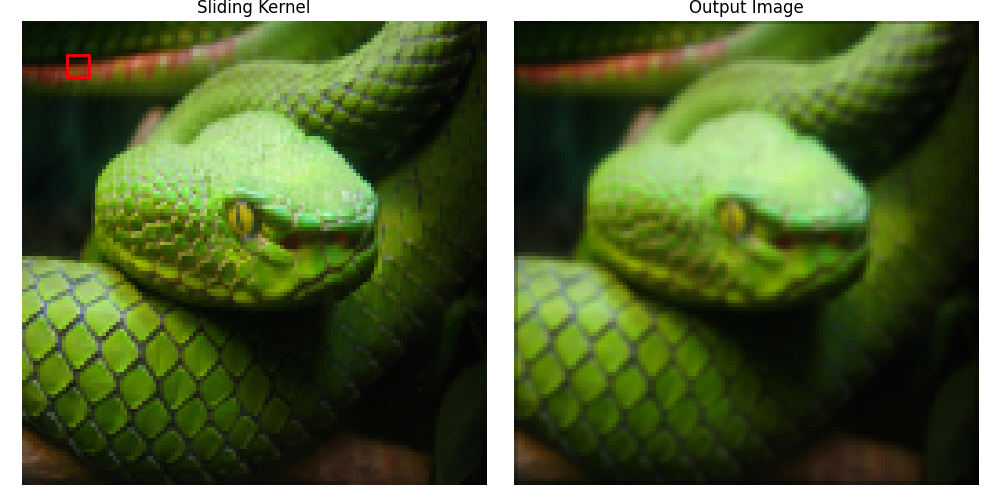
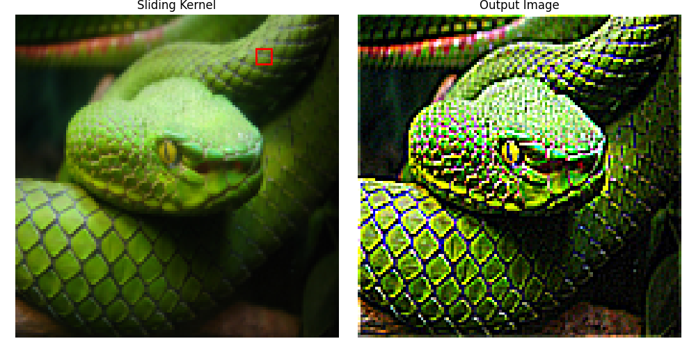
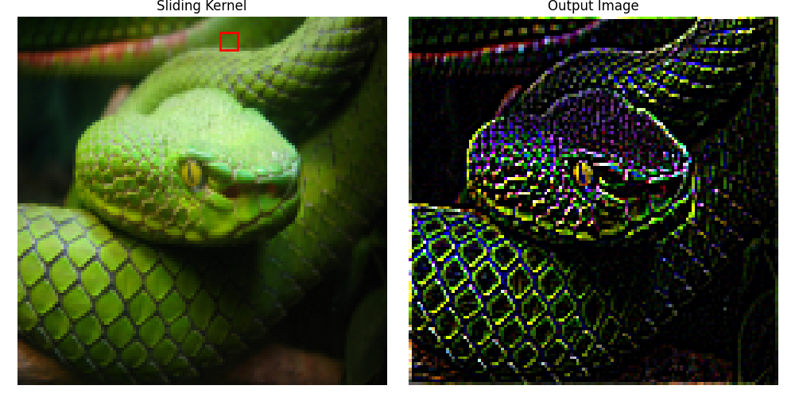
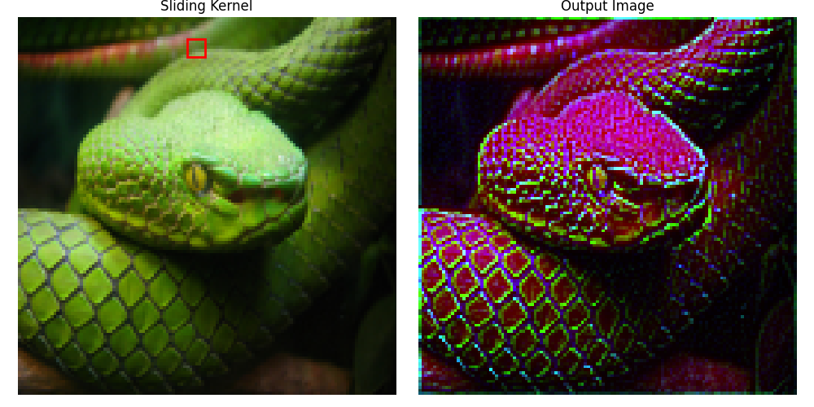

# Introduction


This python script uses matplotlib to simulate a 2D convolution. You can specify different kernels to create different Conovlutional effects on any image of any size. 

### Gaussian blur 

```python
kernel = [
    [1, 2, 1],
    [2, 4, 2],
    [1, 2, 1]
] / 16 
```
### Image Sharpening 

```python
kernel = [
   [-1, -1, -1],
    [-1, 9, -1],
    [-1, -1, -1], 
] 
```
### Edge Detector

```python
kernel = [
   [-1, -1, -1],
    [-1, 8, -1],
    [-1, -1, -1], 
] 
```
### Compound Convolution

The kernel uses a different filter on each RGB channel. It blurs the Red channel, sharpens the Blue channel and keeps only the edges on the green channel

```python
kernel = [[
    # R channel Blur
   [1/16, 2/16, 1/16],
   [2/16, 4/16, 2/16],
   [1/16, 2/16, 1/16],
], [
    # G channel Edge
   [-1, -1, -1],
    [-1, 8, -1],
    [-1, -1, -1],
], [
    # B channel Sharpen
   [-1, -1, -1],
    [-1, 9, -1],
    [-1, -1, -1],  
]]
```